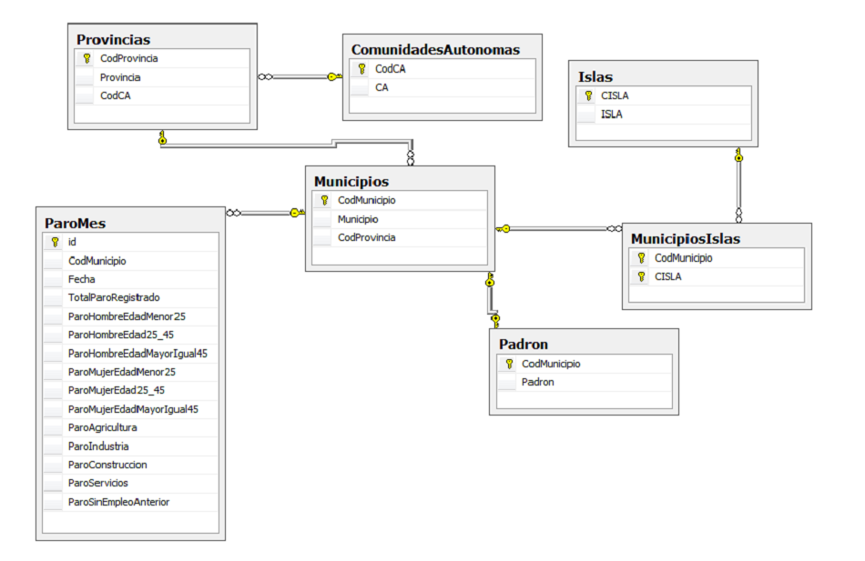

```
Campeonatos Autonómicos de Formación Profesional Canarias 2013
Familia Informática y Comunicaciones
CICLO DE GRADO SUPERIOR - DISEÑO WEB
```

# Ejercicio 1

Se trata de mostrar y gestionar mediante una aplicación web una base de datos que contiene datos de paro y padrón a nivel municipal.

Los apartados a desarrollar son libres, evaluándose la complejidad de lo desarrollado, teniendo que contener tanto consultas como actualizaciones de la Base de datos.

La estructura de datos identifica la pertenencia de cada municipio a su provincia y comunidad autónoma, así como si está ubicado en una isla.

La estructura de datos es la siguiente:



> [ParoCrearSQLServer.sql](files/ParoCrearSQLServer.sql "BBDD SQL Server")

> [ParoCrearMySQL.zip](files/ParoCrearMySQL.zip "BBDD MySQL")
