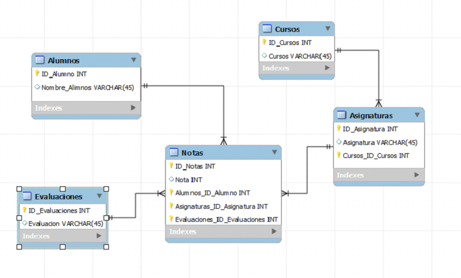

```
Campeonatos Autonómicos de Formación Profesional Canarias 2013
Familia Informática y Comunicaciones
CICLO DE GRADO SUPERIOR - DISEÑO WEB
```

# Ejercicio 2

Implementar un Site que permita actualizar y mostrar notas de Alumnos.

Se implementa el siguiente modelo de datos:




Se desarrolla un formulario para cada una de las tablas:
* Alumnos
* Cursos
* Evaluaciuones
* Asignaturas
* Notas

Se desarrollan diferentes consultas para ser mostradas:
* Calificaciones por alumnos en una evaluación
* Calificaciones de todos los alumnos en una asignatura
