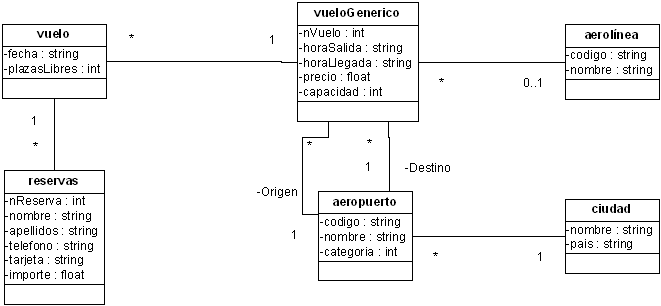
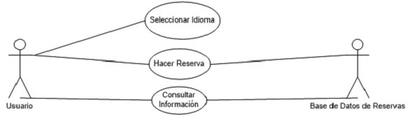

```
Campeonatos Autonómicos de Formación Profesional Canarias 2013
Familia Informática y Comunicaciones
CICLO DE GRADO SUPERIOR - DISEÑO WEB
```

# Ejercicio 3

Implementar un Site que permita la gestión de reservas de billetes de avión.

* El sistema de reservas de billetes de avión permite al usuario hacer consultas de vuelos y reserva de billetes.
* En el menú horizontal superior la aplicación permitirá el cambio de idioma: valenciano, español e inglés.
* En el marco central el sistema presenta una pantalla de bienvenida y la descripción de los servicios disponibles:
  *	consulta de vuelos con billetes disponibles y
  * reserva de billetes.
* En el marco izquierdo se muestran las opciones de búsqueda de vuelos. Se permitirá especificar el coste máximo del billete, por defecto aparece 750 € que puede modificarse. Se permitirá fijar a partir de qué hora se desea que tengan lugar las salidas y de igual forma hasta qué hora se quiere que tenga lugar la llegada.

  Por ejemplo: se pueden buscar vuelos que salgan después de las 12h y que lleguen antes de las 15h.

  También podría incluirse una opción que permitiera seleccionar las aerolíneas deseadas.

* Cuando se pulse en el botón del marco izquierdo de búsqueda aparecerá en la parte central un listado de vuelos genéricos con la siguiente información: número de vuelo, aeropuerto de origen y de destino, hora de salida y de llegada, compañía, precio y la opción de seleccionar dicho vuelo.

* Si se selecciona un vuelo aparecerá en la parte central un listado de fechas en la que tiene lugar un vuelo con plazas libres, así como la opción seleccionar para cada fecha. Si se selecciona un vuelo aparecerá un formulario con el número de vuelo, fecha, importe, y la siguiente información a rellenar: nombre del usuario, apellidos, teléfono y número de tarjeta de crédito.

* Si el usuario cancela no se realizará la reserva, pero si se confirma la reserva quedará realizada.

* La reserva se realiza para un vuelo concreto en una fecha específica.
* Se ha de indicar el número de tarjeta para permitir al usuario adquirir el billete.
* Los billetes estarán disponibles para ser recogidos por el cliente en el mostrador del aeropuerto antes de la salida del vuelo.




