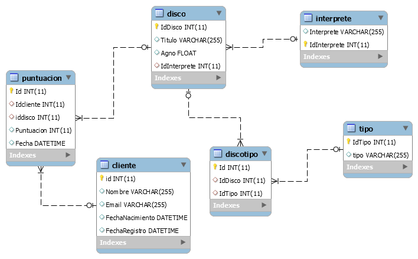

```
Campeonatos Autonómicos de Formación Profesional Canarias 2016
Familia Informática y Comunicaciones
CICLO DE GRADO SUPERIOR - DISEÑO WEB
```

# Criterios de la prueba para Desarrollo de Aplicaciones Web

Se tratará de generar una aplicación web, en cualquier tecnología que muestre y acceda a los datos de una Base de Datos propuesta. En la fase presencial se solicitarán varios apartados a desarrollar sobre la misma base de datos. Se suministra la estructura y los insert en sql: SQL Server y MySQL.

Se trata de una base de datos que contiene información de discos y las valoraciones que hacen unos clientes sobre ellos.

A cada disco se le relaciona con un intérprete y con varias tipologías.

 Viene precargada con información.



> [11DiscosCrear.sql](files/11DiscosCrear.sql "BBDD SQL Server")

> [11DiscosCrearMysql.sql](files/11DiscosCrearMysql.sql "BBDD MySQL")

Cada apartado se valorará entre 0 y el valor especificado, según la calidad y dificultad de la solución propuesta, según el criterio de cada miembro del tribunal evaluador.

Con los mismos criterios se evaluará tanto el programa inicialmente elaborado en los centros como el que se realice en la prueba presencial, con un peso del 50% de la nota final en los dos casos.

Los elementos a evaluar y las puntuaciones máximas de referencia de cada uno son:

**2 puntos: presentación del proyecto por parte del alumnado.**

**4 puntos: adecuación y calidad de la solución propuesta, teniendo en cuenta elementos como los siguientes:**
* Adecuación de las opciones desarrolladas.
* Complejidad de la solución aportada.
* Que no sea una mera aplicación de generadores automáticos de código.
* Visión de conjunto de la solución.
* Uso de elementos de seguridad adecuados.

**4 puntos: lado servidor**
* Acceso a base de datos correcto: 1 punto
*  Acceso a base de datos eficiente: 1 punto
* Uso de tecnologías complejas o frameworks MVC: 1 punto
*  Facilidad de modificación posterior (plantillas, configuración, …): 0,5 puntos
* Uso de un servicio web: 0,5 puntos

**3 puntos: lado cliente**
* Responsive y adaptado para dispositivos móviles: 1 punto
*  El código HTML, CSS y JavaScript deben estar en ficheros y directorios separados: 0,25
puntos
*  Generar CSS para que la web tenga dos tamaños de fuentes (al menos 3 px de diferencia
entre tamaños): 0,5 puntos
*  Accesibilidad de todas las páginas creadas: 0,25 puntos
*  Complejidad del código del lado cliente: 0,5 puntos
*  Uso de librerías o frameworks del lado cliente: 0,5 puntos

**2 puntos: diseño**
*  esquema de colores coherente a "web-safe colours": 0,25 puntos
*  incluir en la página maestra un "mapa de imagen" mediante CSS que sirva como publicidad
de la web, se valorará que el archivo pese lo menos posible y que no se realice con
herramientas: 0,5 puntos
*  incluir en el diseño de todo el sitio Web un logotipo vectorizado con peso inferior a 2KB: 0,5
puntos
*  Incluir iconos vectorizados con peso inferior a 1KB: 0,5 puntos
*  calidad y profesionalidad del diseño completo: 0,25 puntos
