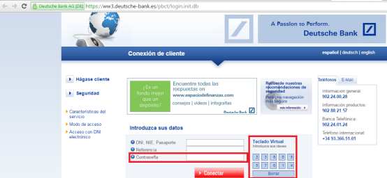

```
Campeonatos Autonómicos de Formación Profesional Canarias 2016
Familia Informática y Comunicaciones
CICLO DE GRADO SUPERIOR - DISEÑO WEB
```

# Modificaciones del ejercicio

**Modificación 1**

Realizar las modificaciones necesarias de BBDD, Backend y Frontend, para  que  solo los usuarios registrados, y validados por la aplicación, puedan realizar las votaciones. Para ello , los usuarios deberán de contar con una contraseña y se permitirá el alta de nuevos usuarios.

Tanto para el alta de usuarios como para el logeo de estos, en el campo contraseña, se deberá usar una botonera numérica, similar a la que presentan algunos bancos, no permitiéndose otra manera de introducir los datos. Un ejemplo, de lo que se pide, se podría ver en la siguiente captura de pantalla:



**Modificación 2**

Realizar las modificaciones necesarias de BBDD, Backend y Frontend para incluir una nueva opción en la aplicación denominada "Más votados". Esta opción, será accesible a todos los usuarios y mostrará un diagrama de barras con los 5 discos mejor valorados.
Estos diagramas de barras se han de construir usando Canvas o SVG dinámicos. Es decir, creados a partir de la información obtenida del lado del servidor en cada momento.

**Modificación 3**

La aplicación debe ser correctamente visualizada en, al menos, los siguientes navegadores en sus últimas versiones: Chrome, IE/Edge, Firefox y Opera.

**Modificación 4**

Realizar una presentación, mediante un Pitch de 5 minutos, defendiendo la solución implementada, después de las modificaciones, y responder a las preguntas planteadas por el tribunal.
