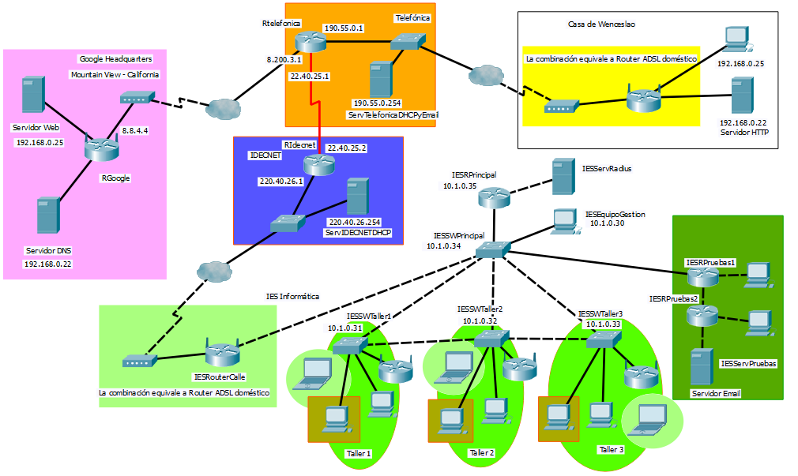

#INTRODUCCIÓN

Se utilizará el simulador Packet Tracer, que CISCO, a través de su programa NetAcad, nos permite utilizar.

> Recordar que este simulador suele tener problemas de estabilidad, por lo que es importante el hacer copias de seguridad cada cierto tiempo.

La tarea consiste en implementar el diseño de arriba mediante Packet Tracer.
Se recomienda al competidor que lea con detenimiento todo el enunciado antes de empezar.

#DESCRIPCIÓN DEL PROYECTO Y LAS TAREAS

El ejercicio presenta varias zonas diferenciadas por colores.

La primera zona, representada en color rosa, muestra las instalaciones de “Google HeadQuarters”
con sus dos servidores:
* Servidor DNS que utilizarán todos los equipos para resolver sus nombres.
* Servidor Web accesible desde todos los equipos del diseño con la URL http://www.google.com,
que debe mostrar un mensaje al acceder “Servidor Web de Google”.

La segunda zona, representada en color naranja, muestra al ISP “Telefónica” que
dispone de un servidor DHCP y un servidor de Email con el dominio telefonica.net
 que da servicio a sus abonados, entre ellos a la “Casa de Wenceslao”.

La tercera zona, representada en color amarillo, muestra la “Casa de Wenceslao”
que es un abonado del ISP Telefónica como se ha comentado anteriormente. En dicha
casa existe un servidor HTTP accesible desde cualquier equipo del diseño con la
URL http://wenceslao.telefonica.net

La cuarta zona, representada en color azul, muestra al ISP “IDECNET” que dispone
de un servidor DHCP para sus abonados entre los que se encuentra el “IES Informática”

Los ISPs de “IDECNET” y “Telefónica” y sus conexiones representan INTERNET en este
supuesto simplificado.

La quinta zona, representada por diversos tonos de verdes, representa al “IES Informática”
que es un abonado del ISP IDECNET.

A continuación se detallan más aspectos de la configuración:

En INTERNET, representado aquí de forma abreviada por los ISP's de Telefónica e IDECNET se conectan los diversos equipos utilizando enrutamiento estático. (Es una simulación).

El Equipo de Gestión IESEquipoGestion es el único que tendrá acceso vía Telnet a los dispositivos:
* IESRPrincipal
* IESSWPrincipal
* IESSWTaller1
* IESSWTaller2
* IESSWTaller3

Para conseguir el punto anterior debes configurar una Vlan de Gestión. Debes utilizar
para la VLAN de gestión la red más pequeña posible que aglutine a todas las IPs
que se muestran en el diseño de la red.

El Servidor Radius (IESServRadius) dará servicio a los dispositivos inalámbricos
 que se encuentran en cada uno de los tres talleres 1, 2 y 3. De esta forma cada
  alumno tiene su usuario y contraseña, y podrá autentificarse indistintamente
  en cualquiera de los tres dispositivos inalámbricos con el mismo usuario y
  contraseña. Para las pruebas crea los usuarios alumno1, alumno2 y alumno3.

Existirán en los talleres al menos 3 vlans: (lo normal es que haya más)
* VLAN 30: Routers inalámbricos que dan conectividad inalámbrica a los Portátiles (Portátiles en círculos)
* VLAN 40: Para los profesores. 1 PC por taller. (PCs en recuadro verde-marrón).
* VLAN 50: Para los alumnos. 20 PCs por taller. (resto de PCs)

Se dispone únicamente de la red 10.20.30.0/25 para las necesidades del IES Informática
a parte de la red de gestión cuyas IPs son las únicas del IES Informática que se
muestran en el diseño. (Se recomienda elegir adecuadamente los rangos de cada red
  para facilitar las ACLs que se piden más abajo)

* Los 4 switches del IES Informática:
    * Tienen configurado VTP de forma que:
    * IESSWPrincipal es el VTP Servidor.
    * Los 3 Switches restantes son VTP clientes.
* Tienen configurado STP.

Debes controlar los accesos para que:
* Desde fuera de la red verde oscuro (red de pruebas) sólo se pueda:
    * Utilizar el servicio de Email (únicamente ese servicio) del Servidor IESServPruebas
    desde la vlan de profesores de los talleres y desde INTERNET.
* Desde dentro de la red verde oscuro (red de pruebas):
    * Sólo se podrá acceder a INTERNET para los servicios HTTP, FTP, Email y DNS.
    * No se podrá acceder a ningún dispositivo de ningún tipo dentro del IES
    Informática (ni siquiera hacer ping).
* El Router IESRPrincipal podrá hacer ping a los PCs de la Vlan de Alumnos pero no al revés.

El Equipo de Gestión IESEquipoGestion podrá además obtener información SNMP de
los Routers y Switches de la Vlan de Gestión.

Desde el PC de la casa de Wenceslao se podrá enviar un Email de wences@telefonica.net
a pepe@iesinformatica.org. Ese email se podrá recibir en cualquier equipo de la
vlan de los profesores del IES Informática.

Todos los equipos y dispositivos de la zona verde oscuro (Zona de Pruebas)
tendrán direcciones IPv6 de forma adicional.

#CRITERIOS DE CALIFICACIÓN

Los instrumentos de calificación serán:
* Fichero de packet tracer con la realización del diseño.
* Presentación realizada ante el tribunal. Se entregará una copia de la presentación digital que haya sido utilizada.
* Documento con los pantallazos brevemente comentados sobre los puntos correspondientes al funcionamiento del supuesto realizado con packet tracer.

Presentación realizada por el competidor:
* Los competidores realizarán una presentación en la que se valorarán los siguientes aspectos sobre alternativas y ventajas/inconvenientes de cada una de ellas:
    * 5% Planteamiento de alternativas para el Enrutamiento en la parte de INTERNET del diseño.
    * 5% Planteamiento de alternativas para la gestión de los dispositivos IESRPrincipal, IESSWPrincipal, IESSWTaller1, IESSWTaller2, IESSWTaller3 desde el Equipo de Gestión.
    * 5% Red inalámbrica. Planteamiento de alternativas.
    * 5% SNMP. ¿Para qué sería interesante usarlo?
    * 10% Impresión general sobre la presentación.

Funcionamiento del fichero de Packet Tracer:
* Se debe crear un documento con pantallazos que demuestre cada uno de los puntos.
* 5% Claridad del fichero de Packet Tracer en el que no deben faltar las Ips de los dispositivos y los nombres de los mismos
* 2% Todos los equipos del diseño pueden resolver sus nombres con el servidor DNS de “Google Headquarters”.
* 2% Todos los equipos del diseño pueden acceder al Servidor Web de “Google Headquarters” y podrán por tanto visualizar su página web.
* 2% El Servidor HTTP de la casa de Wenceslao es accesible desde todos los equipos.
* 5% El Equipo de Gestión IESEquipoGestion es el único que tendrá acceso vía Telnet a través de una Vlan de gestión a los dispositivos: IESRPrincipal, IESSWPrincipal, IESSWTaller1, IESSWTaller2, IESSWTaller3.
* 2% Enrutamiento en la zona de INTERNET.
* 5% Configuración del Servidor Radius.
* 5% Distribución en Vlans en el IES Informática.
* 10% Direccionamiento en el IES Informática disponiendo de la red 10.20.30.0/25 según el enunciado.
* 2% Configuración de VTP.
* 2% Configuración de STP.
* 2% Configuración SNMP. Mostrar pantallazos en el que se vea la información desde el equipo de gestión con la IP de cada uno de los dispositivos utilizando SNMP.
* 2% Configuración IPv6. Debe haber ping entre los equipos de la red de prueba utilizando IPv6.
* 10% Desde el PC de la casa de Wenceslao se podrá enviar un Email de wences@telefonica.net a pepe@iesinformatica.org. Ese email se podrá recibir en cualquier equipo de la vlan de profesores de los talleres del IES Informática.
* Control de acceso:
    * Desde fuera de la red verde oscuro (red de pruebas) sólo se pueda:
        * Utilizar el servicio de Email (únicamente ese servicio) del Servidor
        IESServPruebas desde la vlan de profesores de los talleres y desde INTERNET. (5%)
    * Desde dentro de la red verde oscuro (red de pruebas):
        * Sólo se podrá acceder a INTERNET para los servicios HTTP, FTP, Email y DNS. (5%)
        * No se podrá acceder a ningún dispositivo de ningún tipo dentro del IES Informática
        (ni siquiera hacer ping). (2%)
    * El Router IESRPrincipal podrá hacer ping a los PCs de la Vlan de Alumnos pero no al revés. (2%)

##¿En qué consiste el 30% de cambios realizado?

* Se han cambiado todas las IPs.
* Se han cambiado las reglas de filtrado.
* Se ha cambiado la red de la que se dispone para hacer el direccionamiento.
* Se ha añadido el servicio de Email en el ISP de Telefónica que debe ser posible utilizar para enviar correos con el dominio del IES Informática.
