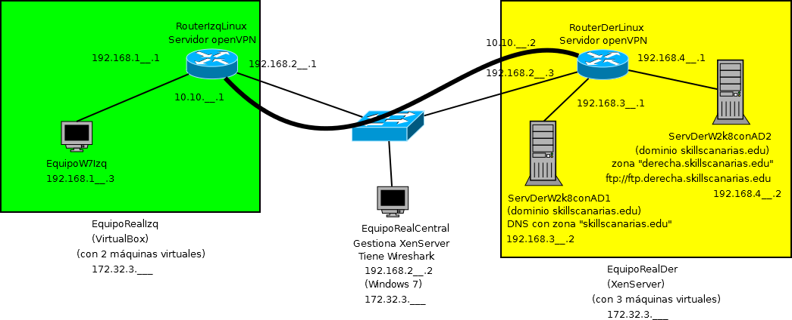

#INTRODUCCIÓN

> Se recomienda al competidor que lea con detenimiento todo el enunciado antes de empezar.

El competidor deberá realizar la configuración que se muestra en la figura.

El competidor dispondrá de tres equipos reales. En ellos se trabajará con el siguiente software:
* EquipoRealIzq: Windows7 Professional 64bits con VirtualBox
* EquipoRealCentral: Windows 7 Professional 64bits con Wireshark y el software de gestión del Xen Server.
* EquipoRealDer: Xen Server.

El competidor instalará y/o configurará en el VirtualBox y XenServer las siguientes 5 máquinas virtuales que se corresponden con el diseño de arriba:
* 2 Windows 2008 Server R2 64 bits
* 1 Windows 7 Professional 64 bits.
* 2 Ubuntu 14.04

Para agilizar la prueba y al competidor le dé tiempo a realizar toda la prueba se ha realizado con antelación:
* En EquipoRealIzq:
    * La instalación del S.O. real con Windows 7.
    * Usuario con permisos de Administrador: skill
    * Contraseña: (sin contraseña)
    * VirtualBox
* En EquipoRealCentral:
    * La instalación del S.O. real con Windows 7.
    * Usuario con permisos de Administrador: skill
    * Contraseña: (sin contraseña)
    * Wireshark
* En el Servidor XenServer:
    * Con credenciales:
        * Usuario: root
        * Contraseña: XenServer
    * 1 máquina virtual limpia de Ubuntu 14.04 con credenciales:
        * usuario: ubuntu1404
        * contraseña: XenServer123
    * 1 máquina virtual limpia de Windows 2008 Server R2 con credenciales:
        * usuario: Administrador
        * contraseña: XenServer123

#DESCRIPCIÓN DEL PROYECTO Y LAS TAREAS

En primer lugar estableceremos los parámetros de los diferentes equipos que
deben coincidir con las que se muestran en el dibujo:
* Nombre: (el que aparece en cada caso en el dibujo)
* IPs: (las que aparecen en cada caso en el dibujo). Antes de la prueba se
ajustarán las IPs de forma que el tribunal rellenará los espacios `__` que
faltan por rellenar según el número del competidor y las circunstancias del aula.

Se creará un dominio con las siguientes características:
* Dominio a crear: skillscanarias.edu
* Usuario: administrador (administrador del dominio) con Contraseña:XenServer123
* Usuario: competidor (usuario del dominio) con Contraseña:XenServer123

El equipo EquipoRealCentral no estará integrado en el dominio `skillscanarias.edu`.

Los equipos que formarán parte del dominio skillscanarias.edu  son:
* ServDerW2k8conAD1
    * En él se instalará el Active Directory.
    * Será también servidor DNS del dominio skillscanarias.edu.
* ServDerW2k8conAD2
    * Será también controlador de dominio del dominio  skillscanarias.edu
    * Contendrá una zona DNS `derecha.skillscanarias.edu` que es un subdominio
    de `skillscanarias.edu`.
    * Tendrá configurado un Sitio FTP que será accesible con la URL
    `ftp://ftp.derecha.skillscanarias.edu` desde todos los equipos excepto desde
    el EquipoRealCentral.
* EquipoW7Izq
    * Este equipo con Windows 7 también estará integrado en el dominio skillscanarias.edu
    * Desde dicho equipo cliente se realizarán todas las tareas administrativas correspondientes al dominio.

Se creará un recurso compartido en el servidor ServDerW2k8conAD1, desde el equipo
cliente EquipoW7Izq, con el nombre compartido en la carpeta `c:\compartidos\ficheros`,
y se dará permisos de sólo lectura para los usuarios del dominio, y con permisos
plenos para los administradores de dominio.

Se realizará la conexión automática al iniciar sesión del usuario competidor en
la unidad g: del recurso compartido compartido.

Para todos los usuarios del dominio skillcanarias.edu, se creará un fondo de
pantalla jpg que aparezca como fondo de pantalla al iniciar su sesión.

Los dos puntos anteriores deben funcionar independientemente de la máquina del
dominio skillscanarias.edu dónde se inicie sesión.

#CONEXIÓN ENTRE LAS ZONAS VERDE Y AMARILLA

Se instalará Linux en ambas máquinas virtuales RouterIzqLinux y RouterDerLinux que funcionarán como:
* Router con las interfaces virtuales necesarias.
* Servidor OpenVPN de tal manera que se implemente una VPN site-to-site.

En el equipo EquipoRealCentral:
* Se llevará la gestión del Servidor XenServer.
* Se demostrará que no es posible ver la información transmitida mediante FTP
entre el cliente EquipoW7Izq y el servidor ServDerW2k8conAD puesto que dicha
información se transmite a través del túnel VPN.

#CRITERIOS DE CALIFICACIÓN

Los instrumentos de calificación serán:
* Presentación realizada ante el tribunal. Se entregará una copia de la
presentación digital que haya sido utilizada.
* Documento de texto con los pantallazos brevemente comentados sobre los puntos
correspondientes al funcionamiento del supuesto realizado.

Presentación realizada por el competidor:
* Los competidores realizarán una presentación en la que se valorarán los siguientes
aspectos:
    * 5% Conexión VPN realizada. Alternativas. Ventajas/Inconvenientes.
    * 5% Configuración de AD realizada. Alternativas. Ventajas/Inconvenientes.
    * 5% Explicación del funcionamiento correcto de la configuración VPN realizada
    con la ayuda de Wireshark.
    * 5% Impresión general sobre la presentación.

* Funcionamiento del supuesto realizado:
    * Se debe crear un documento con pantallazos con una breve descripción cada
    uno de ellos que demuestre los puntos que se piden.
    * Pantallazo de cada una de las 9 máquinas con su IP, puerta de enlace y DNS,
     todas sus interfaces.
    * Pantallazo de la tabla de encaminamiento de las dos máquinas virtuales con
    Ubuntu 14.04.
    * Pantallazo de la configuración de VPN en las dos máquinas virtuales de Ubuntu 14.04.
    * 20% Funcionamiento correcto de la VPN con los pantallazos siguientes:
        * tracert desde EquipoW7Izq a ServDerW2k8conAD1.
        * tracert desde EquipoW7Izq a ServDerW2k8conAD2.
        * tracert desde EquipoW7Izq a EquipoRealCentral.
        * Pantallazo/s de Wireshark en EquipoRealCentral demostrando que ha
        funcionado la VPN.
    * 20% En cuanto a la configuración del AD los pantallazos que demuestren:
        * La configuración del AD realizada.
        * Inicio de sesión dónde se vea la unidad g: del recurso compartido y la
        imagen de fondo.
    * 20% Demostración de que se ha replicado toda la información del AD adecuadamente.
    * 20% Demostración del funcionamiento del Sitio FTP que será accesible con la URL `ftp://ftp.derecha.skillscanarias.edu` desde todos los equipos excepto desde
    el EquipoRealCentral.

#¿En qué consiste el 30% de cambios realizado?

En el equipo EquipoRealIzq:
* Antes había un Controlador de Dominio que ya no existe.
* Antes la máquina real iba a ser Ubuntu y ahora es Windows 7.
En el equipo EquipoRealDer:
* Antes había un Servidor Miembro del dominio que ahora no existe.
* Ahora hay un nuevo Controlador de dominio que antes no estaba y que reúne las
funciones del antiguo controlador de dominio de la izquierda y el servidor miembro de la derecha.
* Se han cambiado todas las IPs del ejercicio.
